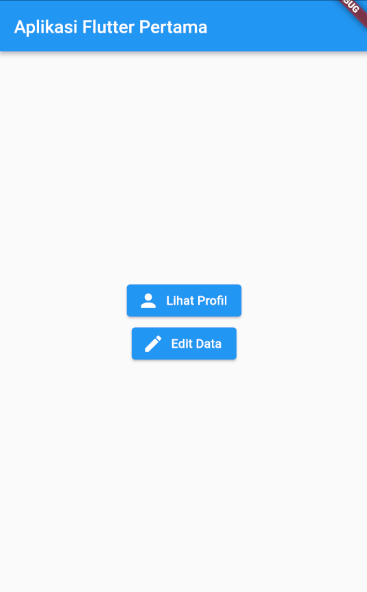
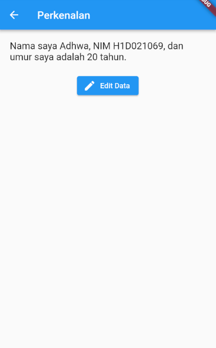
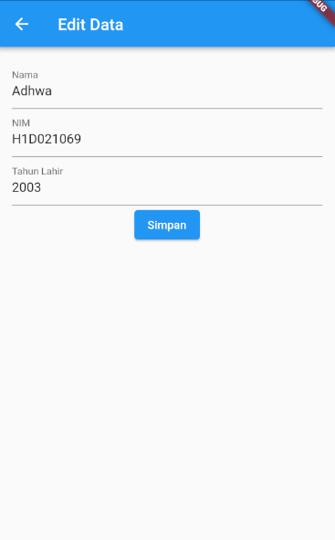

# Tugas Pertemuan 2

## Perubahan
### main.dart
Pada ```'main.dart'```, dilakukan penambahan tombol yang mengarahkan pengguna ke halaman ```'tampil_data.dart'``` dan ```'form_data.dart'```. Tombol **"Lihat Profil"** mengarahkan pengguna ke halaman tampilan profil, sedangkan tombol **"Edit Data"** memungkinkan pengguna untuk mengedit data yang ada.

### tampil_data.dart
Pada ```'tampil_data.dart'```, terdapat teks dinamis yang menggunakan variabel nama, nim, dan umur (yang dihitung sebagai selisih tahun sekarang dan tahun lahir) sehingga data yang ditampilkan selalu sesuai dengan nilai yang diisi oleh pengguna.

### form_data.dart
Dalam ```'form_data.dart'```, perubahan kode telah dilakukan sehingga nilai-nilai yang dimasukkan oleh pengguna dapat disimpan ke dalam variabel masing-masing. Hal ini memungkinkan untuk menampilkan data yang telah diubah kembali pada halaman ```'tampil_data.dart'```.

## Screenshot Hasil




